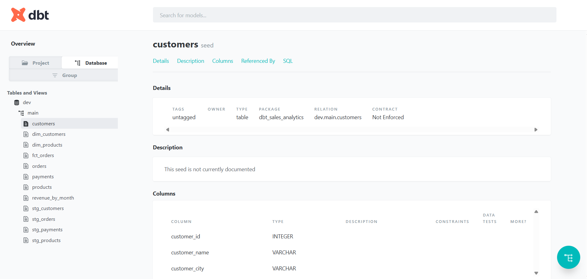

# dbt DuckDB Sales Analytics Project

## 📌 Overview

This project demonstrates a modern data pipeline using dbt and DuckDB.

It transforms raw CSV data into clean, structured analytical models.

## 🧱 Architecture

* Seeds: raw data (CSV files)
* Staging: cleaned and standardized data
* Marts: business-ready tables

## ⚙️ Tech Stack

* dbt
* DuckDB
* SQL

## 🚀 How to Run

```bash
dbt seed
dbt run
dbt test
dbt docs generate
dbt docs serve
```

## 📊 Models

* stg_customers
* stg_orders
* fct_orders
* revenue_by_month

## 🎯 Purpose

This project showcases:

* data modeling
* SQL transformations
* data quality testing
* documentation with dbt

## 📸 Lineage


